# MTU 进度记录

## MTU不同调度策略的实现

下面的AVG FCT结果的参数设置为：

```shell
flow_Count = 1001
loss_rate = 0.005
bandwidth = 40Gbps
load = 0.7
```

### RR轮询

- [x] 思路: 每个流维护一个队列（丑陋但简单），维护一个指针指向previous使用的队列 index，每次发送前寻找下一个使用的非空队列

1. **create**：

- [x] 队列初始化时初始化为65535个queue的mq，初始化queue_index 为 0【65535太多了，这里修改为所需流个数的queue（上帝视角了）】

- [x] 第0个作为最高优先级的队列，只要有packet就先发（没有附加任何Tag的分组放到这里 ）

- [x] flow application sending packet with (priority == flow ID)，flow ID 从 1 开始计数 

2. **enqueue：**

	- [x] 按照priority入队，即1号队列对应1号流，prototype中最多只有64535条流
3. **Dequeue：**

	- [x] 出队时使用前一个 queue_index 寻找到下一个存在packet的队列，随后pop packet


### FIFO 先进先出

- [x] 思路：**单队列**，分组packet先来就先发

1. 队列创建方式的修改


### **SJF 短任务优先（非抢占型）**

- [x] 思路：**优先队列** 小流的包进入优先级高的队列，长流的包进入优先级低的队列

1. 按照流的大小分级赋priority
2. Dequeue按优先级
3. Enqueue按优先级

**有发送概率设置：**


**无发送概率设置：**


### **SRPT 最短剩余处理时间优先（伪）**

- [x] 不同队列的发送概率进行计算（目前是3个队列，后两个队列用于发送带TAG的packet，分别为0.7、0.3的权重分配）
- [x] 定时通过不同流的剩余大小，修改Application的MTU和Priority Tag

**单队列版本**


**三队列版本** 【1个tag 2】


### SRPT 最短剩余处理时间优先——6+1队列按照MTU区分Priority版本

- [x] 根据**排队论**求出多个队列的发送概率（调用Python Scipy的线性最优化计算函数）【师姐直接给结果】

	参考文档：

	[使用C/C++扩展Python](https://docs.python.org/zh-cn/3/extending/extending.html)

	[ns3混编Python](https://forsworns.github.io/zh/blogs/20200616/#ns3%E6%B7%B7%E7%BC%96-embedding-python)

	[排队论浅析M\M\1](https://zhuanlan.zhihu.com/p/99131787)

- [x] 乱序到达的处理【none】

- [x] ECN拥塞位设置【none】

- [ ] 修改入队依据，不再依据flowSize计算priority，而是在计算完BestMTU后，根据MTU的值进入对应的队列

- [ ] 修改为6+1个队列，并调整六个队列的发送概率

## Q：编码问题【已解决】

**关于调试？**

- 服务器安不了C++ extension，只能用GDB调试，调试的时候发现直接跑程序链接不了shared lib，需要在环境变量指明LD_LIBRARY_PATH

	```shell
	export LD_LIBRARY_PATH=/home/huangr/MtuInMultiEnv-master/build/
	```

- 写RR的时候遇到了段错误，gdb调试找到了错误堆栈，真心方便【问题在于dequeue计算的nxt idx溢出了，设置为uint_16，初值为-1。。。】

	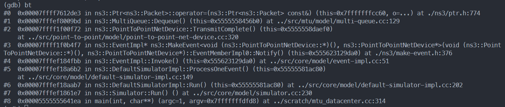

	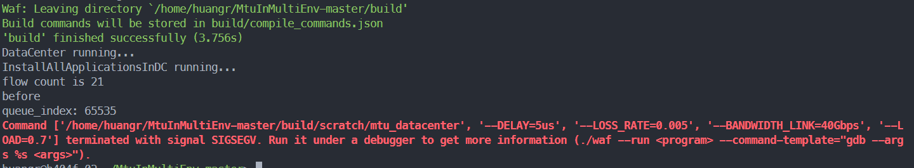

- **SIGIOT** 原因在于每次遍历m_queue的时候都会新建一堆queue，C++没有GC，当m_queue比较小的时候还能hold住，m_queue大的时候就产生了内存不足的报错

	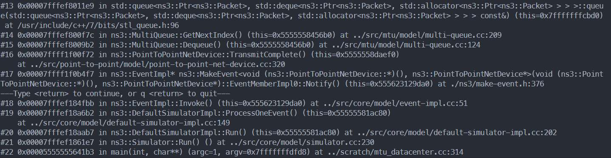

	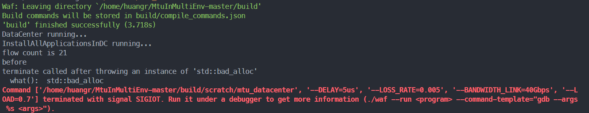

	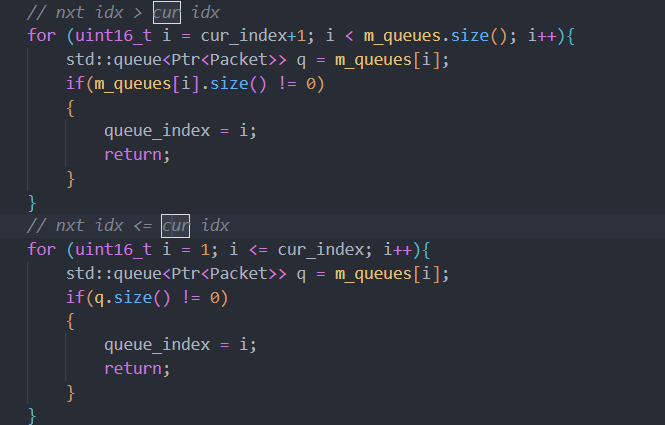

**关于代码**

- 原本的代码中所有packet的优先级都被设置为了2

	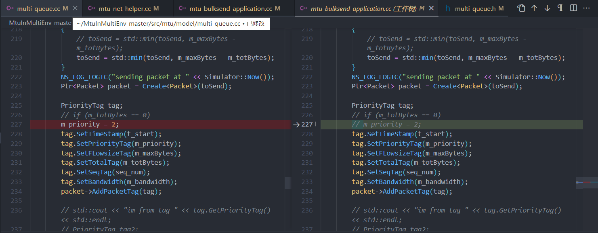

- sendsize未初始化

	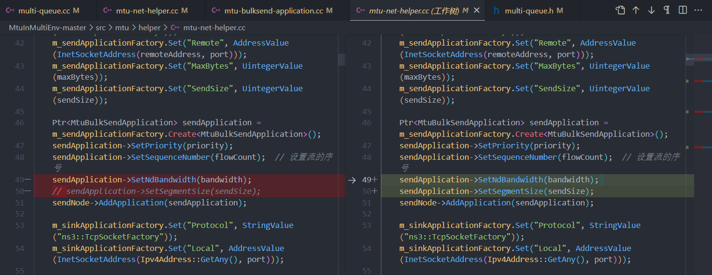

- swich转发延迟没有使用过，应该是不纳入计算吗？

	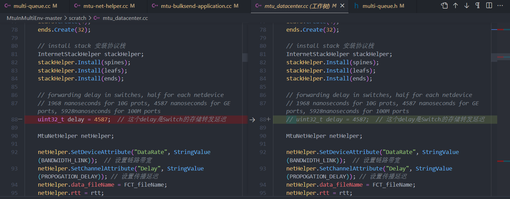

- 某些变量未初始化，应该问题不大

	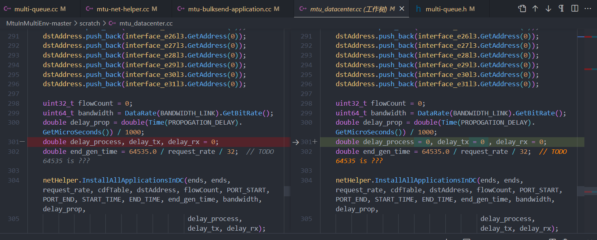

- Muti_queue 的理解：为什么会存在不带tag的包？是ACK的包吗？为什么这样的包要放在最高优先级去发？

- Python调用：不要用Conda！！！

## Q：数据生成相关问题【已解决】

- [x] DataCenter、WAN、MIX的代码是否可以大量复用，换言之是否只需修改拓扑和CDF文件？【只需修改拓扑（已有）】

- [x] 大量生成数据时，命令行参数如何选择？

	【和论文图表设置一致即可】

- [x] 优先队列用3个还是8个？weight权重值如何设置？（没有按照论文的不同包大小设置队列，沿用了按照流大小设置队列）【有发送概率的计算，师姐直接给结果】

- [x] 数据效果不好该怎么办，算法优化效果不明显甚至和预期不符合？【效果尚可】

- [x] RR算法：流个数太多的话跑数据很慢（1000条流可以10分钟跑出来）【暂时先用着】

- [x] 使用数据作图的指导，用Python matplot OR matlab？

	【python matplot 已学习】

- [x] MTU、Priority重计算的间隔时间应该设置为多少比较合适，目前是1.0【应设置为AVG RTT】

- [x] ECN位的设置是否需要完成？【NO】

## NS3 embed Python

**基本思路参考：**[ns3混编Python](https://forsworns.github.io/zh/blogs/20200616/#ns3%E6%B7%B7%E7%BC%96-embedding-python)

**踩坑省流：**

root issue is that waf "pyembed" fails to detect Python 3.8

- waf 版本 2.0.17 以上的用户可以忽略此问题
- waf 版本 低于 2.0.17 的用户需要使用低于Python3.8的版本

最好不要使用conda环境，

**踩坑细节：**

按照上文的博客修改完成wscript后，运行waf configure报错 `Could not build a python embedded interpreter `，但是`Asking python-config for pyembed '--cflags --libs --ldflags' flags`是没有问题的，这就很奇怪了：

```shell
❯ ./waf configure
Setting top to                           : /home/huangrui/MtuInMultiEnv-ScheduleMethod 
Setting out to                           : /home/huangrui/MtuInMultiEnv-ScheduleMethod/build 
Checking for 'gcc' (C compiler)          : /usr/bin/gcc 
Checking for program 'python'            : /home/huangrui/miniconda3/envs/ns3/bin/python 
Checking for python version              : (3, 9, 16, 'final', 0) 
python-config                            : /home/huangrui/miniconda3/envs/ns3/bin/python3.9-config 
Asking python-config for pyembed '--cflags --libs --ldflags' flags : yes 
Testing pyembed configuration                                      : Could not build a python embedded interpreter 
The configuration failed
(complete log in /home/huangrui/MtuInMultiEnv-ScheduleMethod/build/config.log)
```

进一步查看log信息，发现在加入pyembed feature后，waf会通过一个简单的C程序进行检查，在这个检查的过程中，报错信息显示：linker没有找到Python对应的动态链接库，

```shell
------------------------------------------------------------------
Testing pyembed configuration
==>

#include <Python.h>
#ifdef __cplusplus
extern "C" {
#endif
	void Py_Initialize(void);
	void Py_Finalize(void);
#ifdef __cplusplus
}
#endif
int main(int argc, char **argv)
{
   (void)argc; (void)argv;
   Py_Initialize();
   Py_Finalize();
   return 0;
}

<==
[1/2] Compiling build/.conf_check_9b16e5450df8249dda9e88f0f66ca7f8/test.c

['/usr/bin/gcc', '-isystem', '/home/huangrui/miniconda3/envs/ns3/include', '-march=nocona', '-mtune=haswell', '-ftree-vectorize', '-fPIC', '-fstack-protector-strong', '-fno-plt', '-ffunction-sections', '-fdebug-prefix-map=/croot/python-split_1673452671648/work=/usr/local/src/conda/python-3.9.16', '-fdebug-prefix-map=/home/huangrui/miniconda3/envs/ns3=/usr/local/src/conda-prefix', '-I/home/huangrui/miniconda3/envs/ns3/include/python3.9', '-I/home/huangrui/miniconda3/envs/ns3/include', '-DPYTHONDIR="/usr/local/lib/python3.9/site-packages"', '-DPYTHONARCHDIR="/usr/local/lib/python3.9/site-packages"', '-DHAVE_PYEMBED=1', '-DNDEBUG', '../test.c', '-c', '-o', '/home/huangrui/MtuInMultiEnv-ScheduleMethod/build/.conf_check_9b16e5450df8249dda9e88f0f66ca7f8/testbuild/test.c.1.o']
[2/2] Linking build/.conf_check_9b16e5450df8249dda9e88f0f66ca7f8/testbuild/testprog

['/usr/bin/gcc', 'test.c.1.o', '-o', '/home/huangrui/MtuInMultiEnv-ScheduleMethod/build/.conf_check_9b16e5450df8249dda9e88f0f66ca7f8/testbuild/testprog', '-Wl,-Bstatic', '-Wl,-Bdynamic', '-L/home/huangrui/miniconda3/envs/ns3/lib/python3.9/config-3.9-x86_64-linux-gnu', '-L/home/huangrui/miniconda3/envs/ns3/lib', '-lcrypt', '-lpthread', '-ldl', '-lutil', '-lm']
err: /usr/bin/ld: warning: /home/huangrui/miniconda3/envs/ns3/lib/libgcc_s.so.1: unsupported GNU_PROPERTY_TYPE (5) type: 0xc0010001
/usr/bin/ld: warning: /home/huangrui/miniconda3/envs/ns3/lib/libgcc_s.so.1: unsupported GNU_PROPERTY_TYPE (5) type: 0xc0010002
/usr/bin/ld: warning: /home/huangrui/miniconda3/envs/ns3/lib/libgcc_s.so.1: unsupported GNU_PROPERTY_TYPE (5) type: 0xc0010001
/usr/bin/ld: warning: /home/huangrui/miniconda3/envs/ns3/lib/libgcc_s.so.1: unsupported GNU_PROPERTY_TYPE (5) type: 0xc0010002
test.c.1.o: In function `main':
test.c:(.text.main+0x11): undefined reference to `Py_Initialize'
test.c:(.text.main+0x17): undefined reference to `Py_Finalize'
collect2: error: ld returned 1 exit status

from /home/huangrui/MtuInMultiEnv-ScheduleMethod: Test does not build: Traceback (most recent call last):
  File "/home/huangrui/MtuInMultiEnv-ScheduleMethod/.waf3-1.8.19-b1fc8f7baef51bd2db4c2971909a568d/waflib/Configure.py", line 335, in run_build
    bld.compile()
  File "/home/huangrui/MtuInMultiEnv-ScheduleMethod/.waf3-1.8.19-b1fc8f7baef51bd2db4c2971909a568d/waflib/Build.py", line 185, in compile
    raise Errors.BuildError(self.producer.error)
waflib.Errors.BuildError: Build failed
 -> task in 'testprog' failed (exit status 1): 
	{task 139821145156384: cprogram test.c.1.o -> testprog}
['/usr/bin/gcc', 'test.c.1.o', '-o', '/home/huangrui/MtuInMultiEnv-ScheduleMethod/build/.conf_check_9b16e5450df8249dda9e88f0f66ca7f8/testbuild/testprog', '-Wl,-Bstatic', '-Wl,-Bdynamic', '-L/home/huangrui/miniconda3/envs/ns3/lib/python3.9/config-3.9-x86_64-linux-gnu', '-L/home/huangrui/miniconda3/envs/ns3/lib', '-lcrypt', '-lpthread', '-ldl', '-lutil', '-lm']

Could not build a python embedded interpreter
from /home/huangrui/MtuInMultiEnv-ScheduleMethod: The configuration failed
```

按图索骥，把报错贴到google，最后发现这是一个waf 和 python的兼容性问题 **[waf: pyembed broken on Python 3.8](https://gitlab.com/ita1024/waf/-/issues/2239)**

在Redhat bugzilla上，[**Bug 1711638**](https://bugzilla.redhat.com/show_bug.cgi?id=1711638) **- samba fails to build with Python 3.8.0a4 (waf compatibility problem)**，该bug已经被报告并完成了修复。

> It seems like one root issue is that waf "pyembed" fails to detect Python 3.8. Internally, waf creates a C program which runs Py_Initialize(), but the linker fails to find Py_Initialize() because "python3.8-config --libs" output no longer contains -lpython3.8.
>
> I reported the issue to waf:
> https://gitlab.com/ita1024/waf/issues/2239
>
> Fixing waf & other programs requires to add a new --embd option to python3.8-config and pkg-config python3.8 to include -lpython3.8. I'm working on implementing 
>
> https://bugs.python.org/issue36721

此bug已在上游完成了修复，waf 的 2.0.17 release 包含了此次修复，涉及的修改可以从下面这个链接找到。

> \> https://bugzilla.redhat.com/attachment.cgi?id=1572856【也许可以自己把低版本的waf按照这个改一改就能跑起来了，没找到？】
>
> FYI Miro made this change upstream in waf and waf 2.0.17 has been released with the fix.

最终，我选择降级python为python3.6。此时出现了新的bug：

```shell
Testing pyembed configuration
==>

#include <Python.h>
#ifdef __cplusplus
extern "C" {
#endif
	void Py_Initialize(void);
	void Py_Finalize(void);
#ifdef __cplusplus
}
#endif
int main(int argc, char **argv)
{
   (void)argc; (void)argv;
   Py_Initialize();
   Py_Finalize();
   return 0;
}

<==
[1/2] Compiling build/.conf_check_37cd6dbc58b16f0e99dcfe1c97ce8275/test.c

['/usr/bin/gcc', '-isystem', '/home/huangrui/miniconda3/envs/ns/include', '-march=nocona', '-mtune=haswell', '-ftree-vectorize', '-fPIC', '-fstack-protector-strong', '-fno-plt', '-ffunction-sections', '-fdebug-prefix-map=/home/builder/ktietz/cos6/ci_cos6/python_1622833237666/work=/usr/local/src/conda/python-3.6.13', '-fdebug-prefix-map=/home/huangrui/miniconda3/envs/ns=/usr/local/src/conda-prefix', '-fuse-linker-plugin', '-ffat-lto-objects', '-flto-partition=none', '-flto', '-fwrapv', '-I/home/huangrui/miniconda3/envs/ns/include/python3.6m', '-DPYTHONDIR="/usr/local/lib/python3.6/site-packages"', '-DPYTHONARCHDIR="/usr/local/lib/python3.6/site-packages"', '-DHAVE_PYEMBED=1', '-DNDEBUG', '../test.c', '-c', '-o', '/home/huangrui/MtuInMultiEnv-ScheduleMethod/build/.conf_check_37cd6dbc58b16f0e99dcfe1c97ce8275/testbuild/test.c.1.o']
[2/2] Linking build/.conf_check_37cd6dbc58b16f0e99dcfe1c97ce8275/testbuild/testprog

['/usr/bin/gcc', '-Xlinker', '-export-dynamic', 'test.c.1.o', '-o', '/home/huangrui/MtuInMultiEnv-ScheduleMethod/build/.conf_check_37cd6dbc58b16f0e99dcfe1c97ce8275/testbuild/testprog', '-Wl,-Bstatic', '-Wl,-Bdynamic', '-L/home/huangrui/miniconda3/envs/ns/lib/python3.6/config-3.6m-x86_64-linux-gnu', '-L/home/huangrui/miniconda3/envs/ns/lib', '-lpython3.6m', '-lpthread', '-ldl', '-lutil', '-lm']
err: /usr/bin/ld: warning: /home/huangrui/miniconda3/envs/ns/lib/libgcc_s.so.1: unsupported GNU_PROPERTY_TYPE (5) type: 0xc0010001
/usr/bin/ld: warning: /home/huangrui/miniconda3/envs/ns/lib/libgcc_s.so.1: unsupported GNU_PROPERTY_TYPE (5) type: 0xc0010002
/usr/bin/ld: warning: /home/huangrui/miniconda3/envs/ns/lib/libgcc_s.so.1: unsupported GNU_PROPERTY_TYPE (5) type: 0xc0010001
/usr/bin/ld: warning: /home/huangrui/miniconda3/envs/ns/lib/libgcc_s.so.1: unsupported GNU_PROPERTY_TYPE (5) type: 0xc0010002
lto1: internal compiler error: in lto_tag_to_tree_code, at lto-streamer.h:1005
Please submit a full bug report,
with preprocessed source if appropriate.
See <file:///usr/share/doc/gcc-7/README.Bugs> for instructions.
lto-wrapper: fatal error: /usr/bin/gcc returned 1 exit status
compilation terminated.
/usr/bin/ld: error: lto-wrapper failed
collect2: error: ld returned 1 exit status

from /home/huangrui/MtuInMultiEnv-ScheduleMethod: Test does not build: Traceback (most recent call last):
  File "/home/huangrui/MtuInMultiEnv-ScheduleMethod/.waf3-1.8.19-b1fc8f7baef51bd2db4c2971909a568d/waflib/Configure.py", line 335, in run_build
    bld.compile()
  File "/home/huangrui/MtuInMultiEnv-ScheduleMethod/.waf3-1.8.19-b1fc8f7baef51bd2db4c2971909a568d/waflib/Build.py", line 185, in compile
    raise Errors.BuildError(self.producer.error)
waflib.Errors.BuildError: Build failed
 -> task in 'testprog' failed (exit status 1): 
	{task 140586547454136: cprogram test.c.1.o -> testprog}
['/usr/bin/gcc', '-Xlinker', '-export-dynamic', 'test.c.1.o', '-o', '/home/huangrui/MtuInMultiEnv-ScheduleMethod/build/.conf_check_37cd6dbc58b16f0e99dcfe1c97ce8275/testbuild/testprog', '-Wl,-Bstatic', '-Wl,-Bdynamic', '-L/home/huangrui/miniconda3/envs/ns/lib/python3.6/config-3.6m-x86_64-linux-gnu', '-L/home/huangrui/miniconda3/envs/ns/lib', '-lpython3.6m', '-lpthread', '-ldl', '-lutil', '-lm']

Could not build a python embedded interpreter
from /home/huangrui/MtuInMultiEnv-ScheduleMethod: The configuration failed

```

在同样使用waf作为构建工具的 essentia 社区，有人遇到了[相同的问题](https://github.com/MTG/essentia/issues/725)，社区成员有这样一句回答：`We do not support builds within Anaconda environment` 于是我尝试改用本机原有的python 3.6环境，最终解决了问题。

> btw，有人说这个`/usr/bin/ld: error: lto-wrapper failed `错误是编译器与conda的兼容性问题，但我没有细究下去了。

## 数据呈现设计及论文写作

### 方案设计

**采用类似论文中的图表设计 柱状图**

关于不同调度策略的图标设计，采用类似Fig 5的构造：

- 一个Figture展示一个TCP算法的一种场景（参数设置）
- 每个Figture通过在不同的场景（网络拓扑）下展示 4 种调度算法的Normalize FCT对比

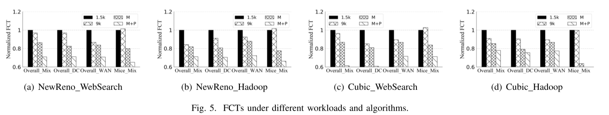

为此，我们最终需要的数据其实只需要各种场景下面的FCT值，这些数据可以通过控制无关变量相同（如流数量、loss rate）进行仿真实验获取。考虑到数据较少，手工完成Normalize即可。

因此，最终的workflow如下：

1. 确定不同的TCP算法，完成嵌入
2. 确定不同网络场景下的CDF表
3. 加入不同网络拓扑的监控Flow Monitor
4. 跑实验，记录数据，挑选效果明显的scenario对应的数据
5. 绘图（matplot）
6. 分析图表结果，添加论文section（分类说明）

这种方式的好处是风格一致，坏处是比较单调

**折线图**

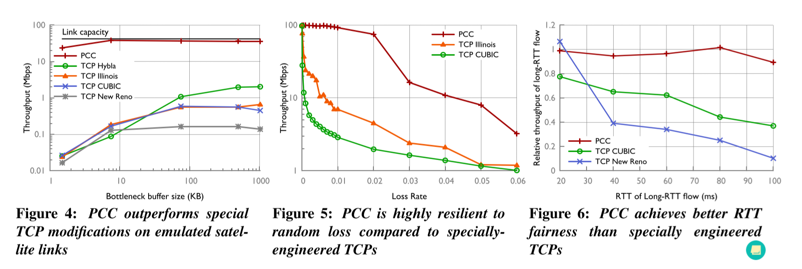

通过**更改不同的指标**，获取在变化的指标下不同排队算法对应的FCT的值。最后将数据绘制为如上图的折线图，横轴是Var指标，纵轴是Normalized FCT，四条折线是四种算法（RR\SRPT\FIFO\SJF）

因此，最终的workflow如下：

- 确定指标和采样间距，写脚本
- 跑实验，整理数据绘图
- 分析图表结果，添加论文section

这种方式的好处是图表信息更多，可以讲讲SRPT调度算法consistently perform well，缺点是动机不足。

【Homa: A Receiver-Driven Low-Latency Transport Protocol Using Network Priorities 强调SRPT的好】

